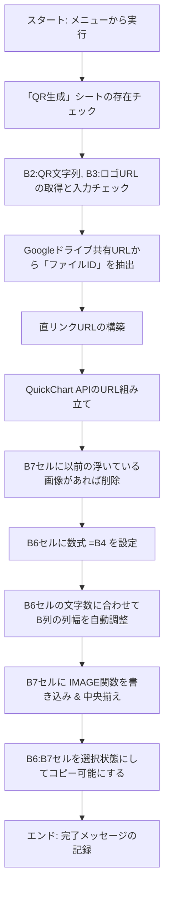

# 仕様書：ロゴ入りQRコード生成スクリプト

本ドキュメントは、Google Apps Script（GAS）とGoogleスプレッドシートを連携させて動作する「ロゴ入りQRコード生成ツール」の仕様書です。
開発したスクリプトの仕組み、スプレッドシートのレイアウト設計、こだわりポイントについてまとめています。1週間後の自分や、他の開発者が読んでもすぐに理解・メンテナンスできるように構成されています。

---

## 1. 概要

本ツールは、Googleスプレッドシート上に入力された「QRコード化したい文字列（URL等）」と「ロゴ画像の共有URL」を元に、**中央にロゴが配置されたデザインQRコード**を自動生成するGASスクリプトです。
生成されたQRコードは、スプレッドシートのセル内にきれいに埋め込まれ、タイトルと共に簡単にコピー＆ペーストできる状態で出力されます。

---

## 2. システム構成・動作環境

- **プラットフォーム**：Googleスプレッドシート / Google Apps Script (GAS)
- **外部API**：[QuickChart QR Code API](https://quickchart.io/)（ロゴ入りQRコードの生成エンジンとして使用）
- **前提条件**：
  - インターネット接続（QuickChart APIとの通信用）
  - Googleドライブ（中央に配置するロゴ画像の保存場所）
  - ロゴ画像は、Googleドライブで「リンクを知っている全員が閲覧可能」に設定されている必要があります。

---

## 3. スプレッドシートのレイアウト（インターフェース仕様）

本スクリプトは、**「QR生成」**という名前のシートで動作することを前提としています。

| セル位置 | 項目名 | 入力データタイプ | 役割・説明 |
| :--- | :--- | :--- | :--- |
| **B2** | QRコード文字列 | テキスト (URL等) | QRコードに変換したい文字列（例: ホームページのURLなど） |
| **B3** | ロゴ画像URL | テキスト (URL) | Googleドライブに保存されたロゴ画像の「共有URL」 |
| **B4** | ラベルテキスト | テキスト | QRコードの上に表示したいタイトルや説明文（改行対応） |
| **B6** | 出力タイトル | 数式 (`=B4`) | スクリプト実行時に自動で `=B4` がセットされ、タイトルが表示されます |
| **B7** | QRコード出力 | 数式 (`=IMAGE(...)`) | スクリプト実行時に生成されたQRコード画像が埋め込まれます（中央揃え） |

---

## 4. 処理フロー（プログラムの動作手順）

カスタムメニューから「ロゴ入りQRコードを生成」を実行した際、スクリプトは以下の順序で処理を行います。



1. **シートの確認**
   - アクティブなスプレッドシート内に「QR生成」シートがあるかチェックします。ない場合は警告を表示して終了します。
2. **入力データの取得と検証（バリデーション）**
   - セル **B2** (QR文字列) と **B3** (ロゴ画像URL) を取得します。
   - B3セルが数式（ハイパーリンクなど）になっている場合でも、正規表現を用いてURL部分を正確に抽出します。
   - 空欄の場合はメッセージボックスでユーザーに警告し、処理を中断します。
3. **GoogleドライブのファイルID抽出と直リンク化**
   - 入力されたGoogleドライブ共有URLから、ファイルID（25文字以上の英数字記号）を正規表現で抽出します。
   - 外部APIから画像にアクセスできるように、Googleドライブの直リンクURL（`https://drive.google.com/uc?export=view&id={FileID}`）へと自動変換します。
4. **QuickChart APIの呼び出しURLの組み立て**
   - 以下のパラメータを指定して、APIリクエストURLを構築します。
     - `text`：QRコード化する文字列（URLエンコード済）
     - `size`：400px（高解像度）
     - `backgroundColor`：白色
     - `centerImageUrl`：直リンク化したロゴ画像のURL（URLエンコード済）
     - `centerImageSizeRatio`：0.22（QRコードの読み取り精度を維持しつつ、ロゴが綺麗に見える黄金比率）
5. **不要な重複画像の削除**
   - スプレッドシート上に「セル上に浮かぶ画像（OverGridImage）」がB7セルに残っている場合、重複を避けるためにスクリプトが自動で削除します。
6. **タイトルの設定と列幅の自動調整**
   - セル **B6** に、B4セルの内容をそのまま引用する数式 `=B4` をセットします。
   - B6に入力されたテキスト（改行も考慮）の最大長を解析します。
   - **半角文字は1、全角文字は2**としてカウントし、文字が絶対に欠けないように最適なB列の幅を動的に計算して自動設定（`setColumnWidth`）します。
7. **QRコードの描画と配置**
   - セル **B7** に、構築したAPIのURLを指定した `=IMAGE("APIのURL", 1)` 数式をセットします。
   - B7セルの高さを `160px` に設定し、画像をセルの「中央揃え（上下左右）」に配置します。
8. **クイックコピーの準備**
   - 処理の最後に、スプレッドシートの選択範囲を **B6:B7** に自動でアクティベートします。これにより、処理が終わった瞬間にユーザーが `Ctrl + C`（Macは `Cmd + C`）を押すだけで、タイトル付きのQRコードをクリップボードにコピーできます。

---

## 5. こだわり・工夫ポイント

本スクリプトには、ユーザーがストレスフリーで美しく使えるように、以下のこだわり機能が組み込まれています。

- **全角・半角を判別する「列幅の自動調整」**
  単なる文字数カウントではなく、全角文字（2幅）と半角文字（1幅）を区別してビジュアル幅を計算します。これにより、タイトルが長くなっても短くても、QRコードがはみ出したり文字が途切れたりすることなく、常に美しいレイアウトが保たれます。
- **改行テキストへの完全対応**
  タイトル（B4セル）に改行が含まれている場合、それぞれの行を個別に測定し、最も長い行を基準にして列幅を決定します。
- **コピペがすぐにできる「自動アクティベート機能」**
  生成完了後、タイトルセル（B6）とQRコードセル（B7）の2つのセルが自動で「選択状態」になります。他の場所に貼り付けたいときに、マウスで選択し直す手間が省けるため、作業効率が劇的に向上します。

---

## 6. 実装ソースコード

本ツールは、以下の2つのGASファイル（または同一スクリプト内）で構成されています。

### 6.1 `onOpen.gs`（メニュー作成）
スプレッドシートを開いた際、ツールバーに専用の操作メニューを自動で追加します。

### 6.2 `generateIconQRCode.gs`（コアロジック）
QRコードの生成、画像の直リンク変換、列幅調整、セルのレイアウト設定を行います。


}
```
